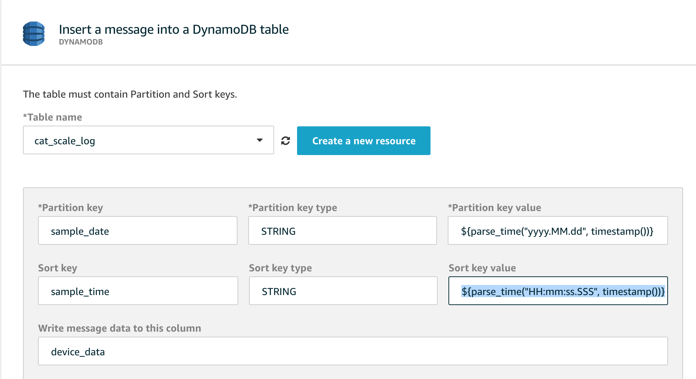

# Arduino Cat Scale

This project performs ongoing scale recordings of a litter box to track when a cat uses it, for how long, and their current weight. The data will hopefully be useful to predict health issues as cats' weight change.  It is designed to work with multiple cats using a custom scale built with Arduino against AWS IoT.

My scale was pretty large (22" x 22") to accomodate a [Litter Robot](https://www.litter-robot.com/), but it should work with a smaller or lighter litter box.


## Basic Arduino-based Scale

The scale is based off [this design I found on Instructables](https://www.instructables.com/Wi-Fi-Smart-Scale-with-ESP8266-Arduino-IDE-Adafrui/).  It utilizes a [Firebeetle 8266 Arduino board](https://www.dfrobot.com/product-1634.html) and a corresponding [LED Cover](https://wiki.dfrobot.com/FireBeetle_Covers-24%C3%978_LED_Matrix).

This project could probably be updated easily to an Espressif 32 / newer chip easily but I tried to stay true to the original Instructable.

In the original Instructable there were links to 3D models that could be printed that would serve as components in the build, but I found them to be too fragile so a I thickened them up a bit [here](3d-models).

My scale looked like this without a cover on it:


I placed another piece of wood on top of this one and then set the scale on top of that.


### Calibration

The scale will send voltage numbers based on HX711 to the Arduino and they need to be converted to either Lbs or Kg. Use the Arduino project [here](arduino/calibrate-scale/calibrate-scale.ino) to do this.  

### Scale Logic

The scale is designed to:

1. wake up and connect to WiFi
2. determine the correct date and time from NTP on the Internet
3. connect to AWS IoT Core to publish measurements and get a shadow configuration
4. when the scale determines that weight has been placed or reset, publish the measurement
5. if the scale sits too long at a non-zero weight it will auto reset

## AWS IoT Core

This project is based on AWS IoT to store the information ultimately in a DynamoDB database.  To do that the secrets.h file needs to be created in the [arduino cat-scale folder](arduino/cat-scale) based on the [AWS secrets template](arduino/secrets.h.template).

The scale can be configured to override defaults using a Shadow named CatScaleConfig.

The scale publishes weight events on MQTT topic `catScale/pub` and listens for messages to reset the scale on `catScale/sub`.

To connect it to AWS IoT, you need an IoT policy and an IoT Thing.  Create the policy similar to the following replacing the AWS account number with your own:

```
{
  "Version": "2012-10-17",
  "Statement": [
    {
      "Effect": "Allow",
      "Action": "iot:Connect",
      "Resource": "arn:aws:iot:us-east-1:<AWS ACCOUNT>:client/Cat-Scale-Firebeetle8266"
    },
    {
      "Effect": "Allow",
      "Action": "iot:Subscribe",
      "Resource": [
        "arn:aws:iot:us-east-1:<AWS ACCOUNT>:topicfilter/catScale/sub",
        "arn:aws:iot:us-east-1:<AWS ACCOUNT>:topicfilter/$aws/things/Cat-Scale-Firebeetle8266/shadow/name/*"
      ]
    },
    {
      "Effect": "Allow",
      "Action": "iot:Receive",
      "Resource": [
        "arn:aws:iot:us-east-1:<AWS ACCOUNT>:topic/catScale/sub",
        "arn:aws:iot:us-east-1:<AWS ACCOUNT>:topic/$aws/things/Cat-Scale-Firebeetle8266/shadow/name/*"
      ]
    },
    {
      "Effect": "Allow",
      "Action": "iot:Publish",
      "Resource": [
        "arn:aws:iot:us-east-1:<AWS ACCOUNT>:topic/catScale/pub",
        "arn:aws:iot:us-east-1:<AWS ACCOUNT>:topic/$aws/things/Cat-Scale-Firebeetle8266/shadow/name/*"
      ]
    }
  ]
}
```

Then create a Thing named `Cat-Scale-Firebeetle8266` and associate the certificate used for it with this policy.  Download the certificates and key from AWS IoT to plug into the `secrets.h` file.

Once this is set up it will begin streaming data to AWS IoT.  

## AWS DynamoDB from IoT Rules

The next step is to get the data to record into a DynamoDB table.  

Create a DynamoDB table named `cat_scale_log` with:

1. Partition Key = `sample_date` as String
2. Search Key = `sample_time` as String

Using AWS IoT rules, create a new rule with the following SQL statement:

`SELECT timestamp() as timestamp, weight, tare FROM 'catScale/pub'`

Add an action to insert into the DynamoDB table `cat_scale_log` with the following settings:

1. Parition Key `sample_date`: `${parse_time("yyyy.MM.dd", timestamp())}`
2. Search Key `sample_time`: `${parse_time("HH:mm:ss.SSS", timestamp())}`
3. Write Message date to: `device_data`

It should look something like this:



Data should now be being stored in your table, but it still needs to be manipulated to determine which cat is using the box.


## AWS DynamoDB Stream Lambda Events

Two diffrent python-based lambda functions exist to determine first that an <b>Event</b> has occurred that signifies a cat has used the litter box. Next, it attempts to determine to which cat the event corresponds.

The functions are:

* [Log Scanner](log-scanner-lambda) - creates event records based on logging from scale
* [Event Matcher](event-matcher-lambda) - assigns cats to events

A policy needs to be attached to the functions to allow them to access the DynamoDB tables.

### Log Scanning

A log entry with a recorded weight of zero usually indicates that the scale has reset after a cat has exited the box. If a zero trigger occurs, a lookback of records is performed to determine when the cat entered the box.  The total duration is then calculated in seconds as well as the maximum weight registered during that timeframe.  This is then recorded as a single event record.

The events need a table to be created in DynamoDB named `cat_scale_event` that has the same keys as the log:

1. Partition Key = `sample_date` as String
2. Search Key = `sample_time` as String

### Event Matching

To determine cats for each event, a settings table must be initialized with the basic cat data for each pet that is to be matched.  The table `cat_scale_settings` should be created with teh following schema:

1. Partition Key = `setting_type` as String
2. Search Key = `setting_id` as String

A setting record for each cat should be created

1. `setting_type` = `cat-definition`
2. `setting_id` = a unique logical name for cat record 
3. `defined_weights` as an Array of objects described below
4. `name` as a String - friendly name for cat

`defined_weights` is an array of map objects with only two keys each: `weight`, `timestamp`

The idea is to initialize the `defined_weights` with a zero entry as the initial entry and give room to override the weight if needed in the future in case of a large fluctuation in that cat's weight.

It should look similar to the following in the console for an item:
